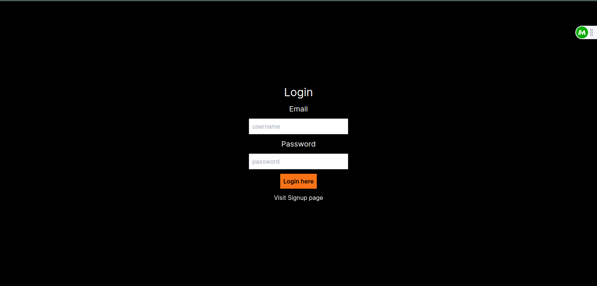

# Next-First

Throughout the development of this repository, I embarked on a journey to master Next.js, a powerful framework for building modern web applications. One of the key highlights of this project is the successful implementation of authentication in Next.js, a feat I achieved thanks to the invaluable guidance and teachings of Hitesh Chaudhary. His comprehensive course on FreeCodeCamp's YouTube channel was an absolute game-changer, providing me with the knowledge and skills to make this project possible.

## Tech Stack

**Client:** Nextjs, TailwindCSS, Nodemailer, TypeScript

**Server:** Nextjs, Mongodb,

## Run Locally

Clone the project

```bash
  git clone git@github.com:ankitbisen28/Nextjs-First.git
```

Install dependencies

```bash
  npm install
```

Start the Development Server

```bash
  npm run dev
```

## Screenshots



## 🚀 About Me

Hello Everyone, Hi, I'm Ankit Bisen, a 20-year-old Software Development Student with a bachelor of Vocational in Software development and experience with MERN Stack Development.

## 🔗 Links

[](https://ankitbisen.live/)
[](https://www.linkedin.com/in/ankitbisen28)
[](https://twitter.com/ankitbisen28)

## 🛠 Skills

Javascript, nodejs, express, mongodb, Nextjs
